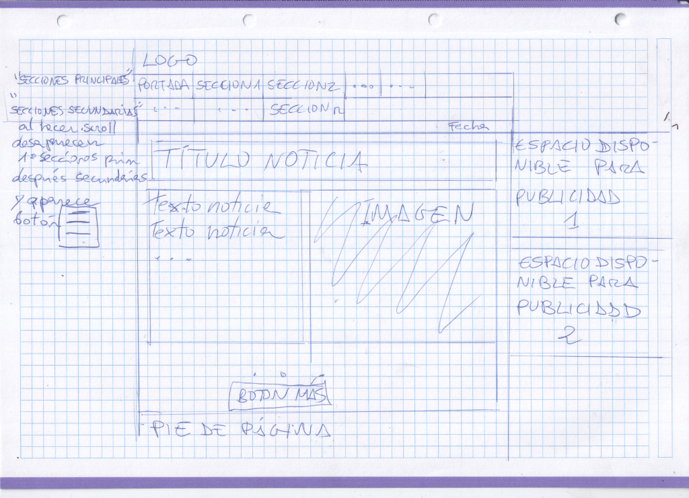
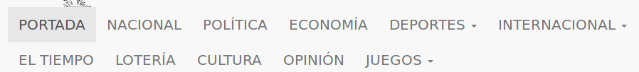
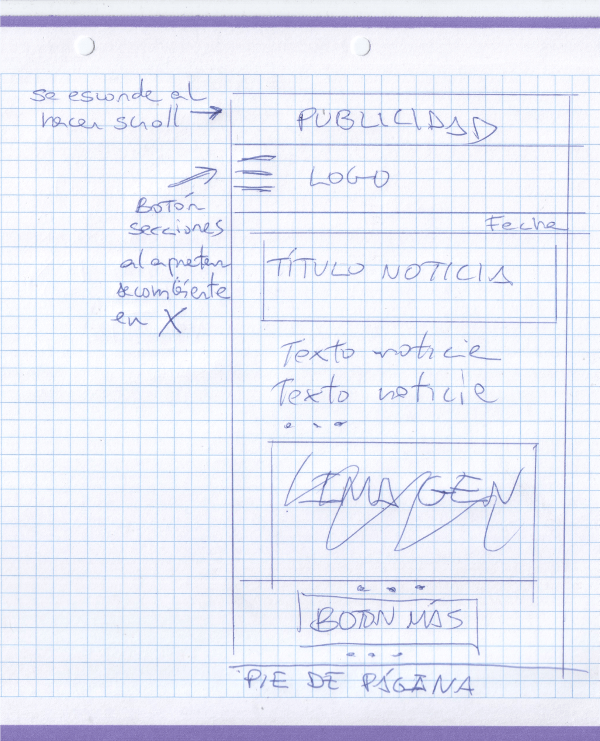

# LLSGI06_Diario_la_Palmera

### Sobre la página

### El proyecto se compone de:
* Tres archivos .html (index.html , noticia1.html y noticia2.html).
* Una carpeta css/ con dos archivos .css (pc.css y mob.css ).
* Una carpeta js/ con un arcivo new.js. 
* Una carpeta data/ con un archivo xml ( rss.xml ) y dos json (1.json y 2.json)
* Una carpeta img/ que contiene 25 (13 .jpg y 12 png ).

### La versión de ordenador

Hay un div ( "nav bar fijo" ) que es donde contiene los enlaces en las secciones.
.
Las secciones están divididas en dos principales y secundarias.
Al hacer scroll se esconden primero las segundas y después la primeras. Para volver a salir se tiene que volver al  principio de la página. Al esconderse las secciones aparece el botón  .La publicidad de la derecha sube o baja cuando se "contrae" o "expande" el div de las secciones.
Arriba del todo a la derecha también hay sitio para otro banner publicitario.

### La versión de móvil 

 
 En el móvil las secciones estań ocultas y salen al apretar el botón  este botón desaparece y aparece .

La publiciad en la versión del móvil esta arriba dl todo y desaparece al hacer scroll.

### La versión de pc y de móvil
Al hacer scroll al final de la página o apretar el botón "cargar más noticias ,carga 3 noticias más (contenidas en 1.json) y después 3 más que están en 2.json. 

### Las imágenes
Algunas proceden de http://openclipart.com ,otras son fotos mias, la del pez procede de la wikipedia. Todas las imágenes han sido optimizadas en https://tinypng.com/ .

El enlace para ver la página es

https://rawgit.com/amadews23/LLSGI06_Diario_la_Palmera/master/index.html
